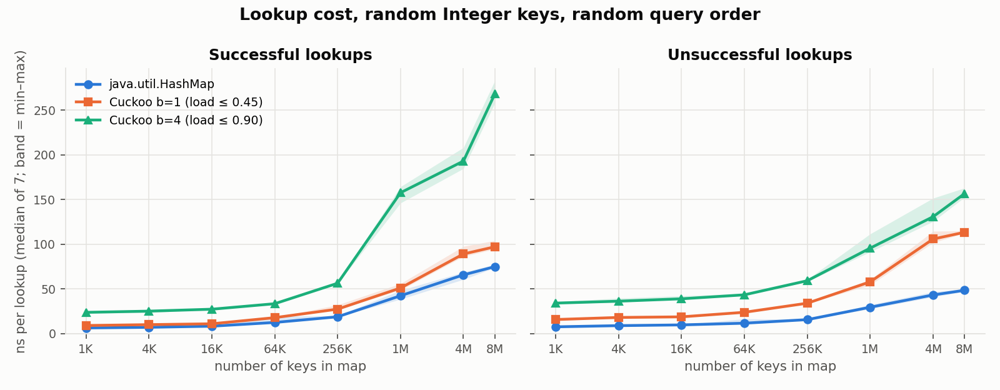
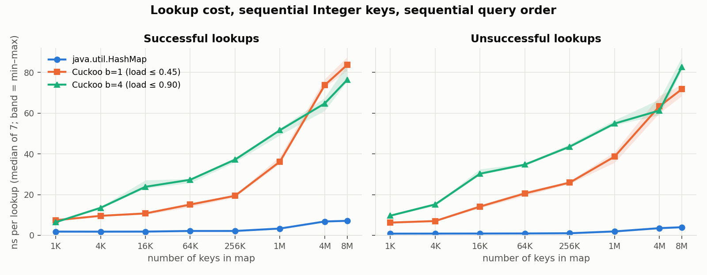
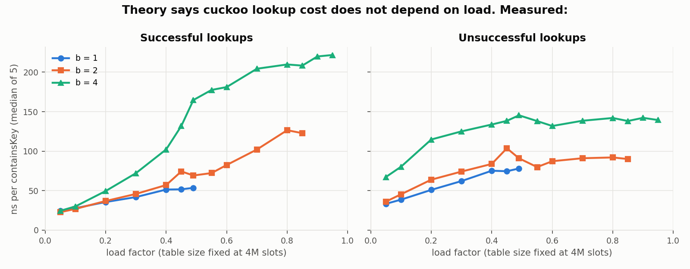
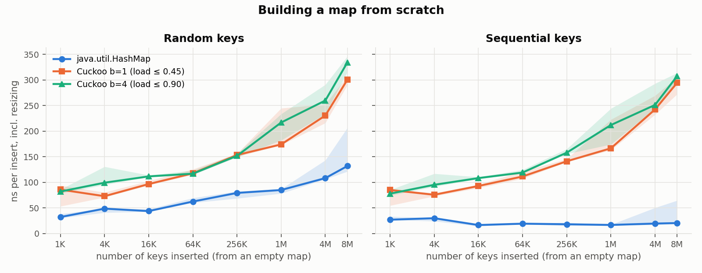
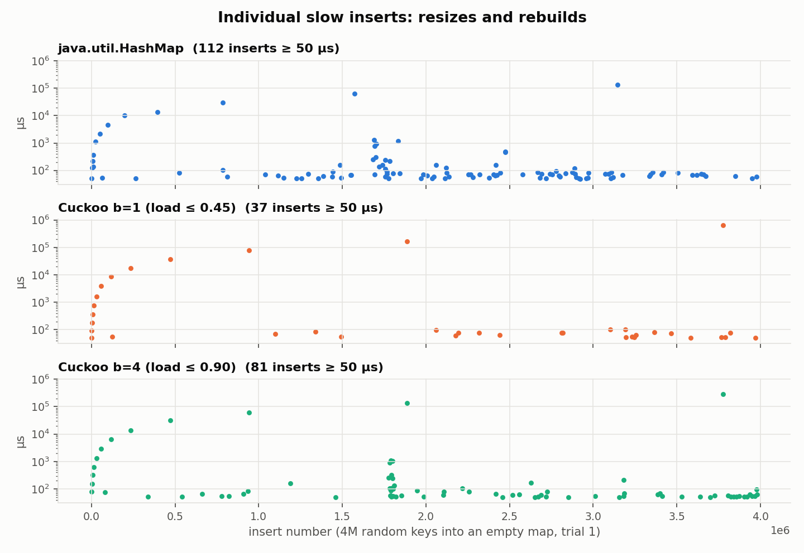
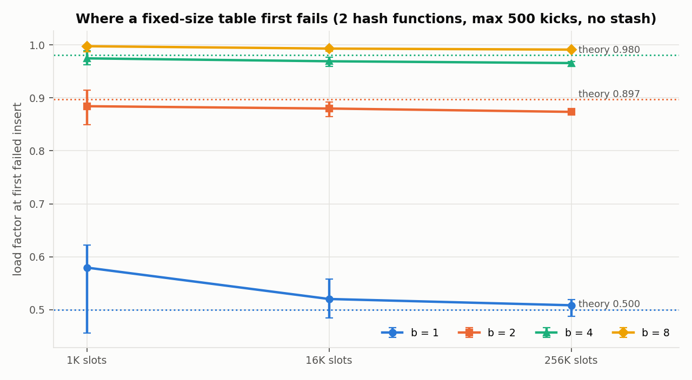
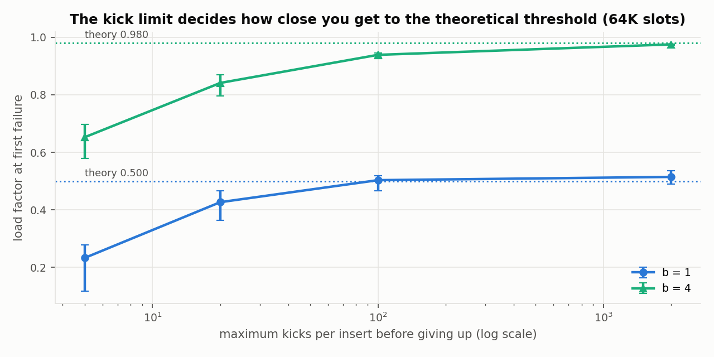
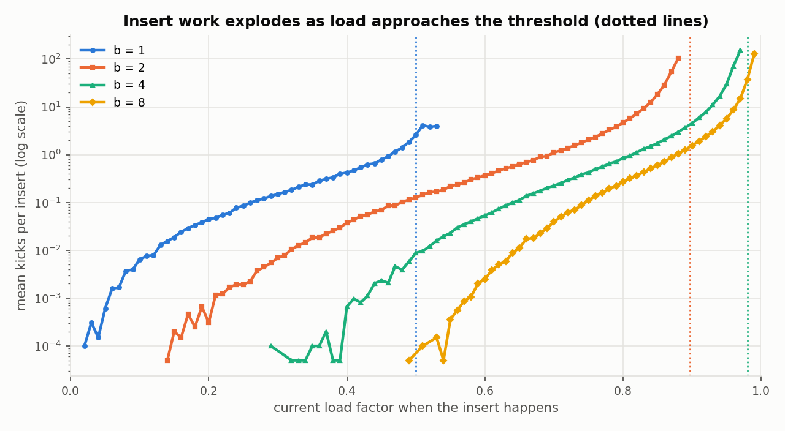
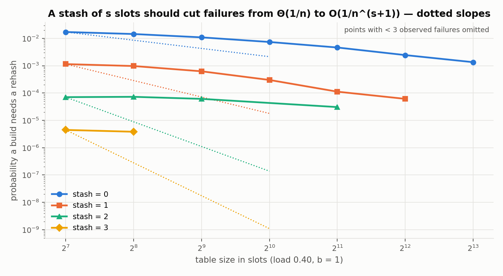
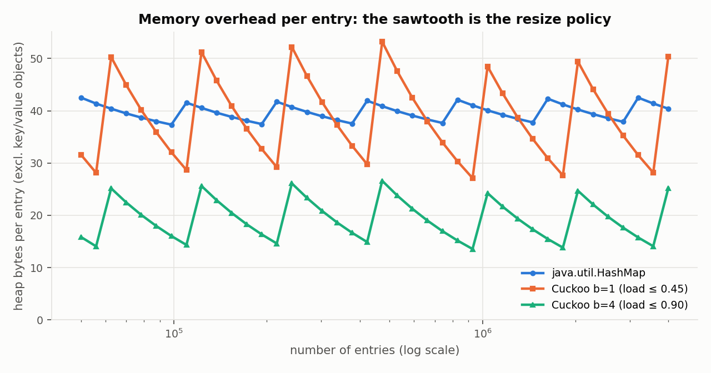

# Cuckoo Hashing vs `java.util.HashMap`: Implementation and Empirical Study

**Track A: implementation and empirical study** · Haris Naeem

---

## (a) What I built

**The data structure.** `CuckooHashMap<K, V>` (`src/main/java/cuckoo/CuckooHashMap.java`, ~490 lines) is a generic Java map based on cuckoo hashing (Pagh & Rodler, 2001). Every key has exactly two candidate buckets, one in each of two tables. A lookup inspects those two buckets and nothing else, so its cost is bounded by a constant regardless of how many keys collide. An insertion that finds both buckets full *evicts* an occupant, which moves to its own alternative bucket, possibly evicting another key, and so on.

**Key design decisions**

| Decision | Choice | Why |
|---|---|---|
| Language | Java 21, no dependencies | The baseline, `java.util.HashMap`, lives in the same runtime, so the comparison is like for like. |
| Layout | Two tables stored as halves of three parallel arrays: `Object[] keys`, `Object[] vals`, `int[] hashes` | No per-entry objects (unlike `HashMap.Node`). Keeping the tables separate guarantees a key's two buckets are always distinct. |
| Bucket size *b* | Configurable. Presets: `standard()` b=1 (max load 0.45), `bucketized()` b=4 (max load 0.90) | The textbook version is b=1. Blocked cuckoo hashing with b=4 raises the achievable load from 50% to ~98%. |
| Hash functions | `fmix32(hashCode() ^ seed)` (MurmurHash3's finaliser) with two random seeds, masked to the table size | Cheap, and re-seeding gives fresh hash functions for a rebuild. |
| Stored hashes | Full 32-bit `hashCode` kept per slot and compared before `equals` | Avoids dereferencing stored key objects on mismatches, and avoids recomputing hashes during rebuilds. |
| Eviction | b=1: deterministic (the victim goes to its other table). b>1: random victim within the bucket (random-walk insertion) | Standard choices; random walk is the practical algorithm for b>1. |
| Kick limit | 16 + 6·log2(slots), overridable | Theory says successful insertions need O(log n) kicks with high probability. |
| Stash | 4 slots by default (Kirsch, Mitzenmacher & Wieder, 2009) | Absorbs rare failed insertions instead of forcing a full rebuild. |
| Failure handling | Stash full → rebuild with new seeds (3 tries) → double the table (up to 2 extra doublings) → *degraded mode* | See below. |

**Extensions beyond the textbook version**

- **Degraded mode for identical hash codes.** Both hash functions are derived from `hashCode()`, so keys with *equal* hash codes share both buckets. No choice of seeds can separate them. If more than 2b + stash such keys arrive, every rebuild must fail. My first version threw an exception after too many attempts, which leaves the map half-rebuilt. The final version falls back to an overflow stash that is allowed to grow, sacrificing the worst-case bound only for the colliding keys. The test *"real String hashCode collisions (Aa/BB family)"* inserts 64 distinct strings with one hash code.
- **Stash draining.** When `remove` frees a slot, stashed keys that can use it move back into the table. This keeps the stash nearly empty so it doesn't trigger unnecessary rebuilds.
- **Instrumentation** (`kicks()`, `rehashes()`, `growths()`, `capacity()`, …) and a **self-check**, `checkInvariants()`, that recomputes every key's legal buckets and asserts it sits in one of them.

**Simplifications.** It does not implement `java.util.Map` (no `entrySet`/`keySet` views), never shrinks, rejects `null` keys, and is not thread-safe.

**Testing.** `CuckooHashMapTest` (33 cases, no JUnit dependency) covers the edge cases: empty map, null values, replacement, equal-but-not-identical keys, growth from one bucket to 1M keys, colliding hash codes, and invalid configurations. Its core is **differential testing**: 200,000 random operations per trial are applied to both `CuckooHashMap` and `HashMap`, and every return value and size is compared, across 7 configurations, two key-space shapes and 3 seeds, with `checkInvariants()` every few hundred operations. To check that the tests can actually catch bugs, `scripts/mutation_check.sh` injects 7 plausible bugs one at a time. **All 7 are caught.** Three of them were *not* caught by my first test suite; see (c).

**Navigating the code.** Start with `put` → `insertNew` → `cuckooWalk` → `rebuild`. `get` is `findSlot` + `findStash`. `VIDEO_NOTES.md` maps the key lines.

---

## (b) Empirical study

### Questions and hypotheses

Cuckoo hashing's selling point is its **worst-case O(1) lookup**. `HashMap` only offers expected O(1) (with treeified O(log n) buckets in the worst case). I set out to test:

| # | Hypothesis (stated before measuring) |
|---|---|
| H1 | Cuckoo lookups are competitive with `HashMap`, and faster for unsuccessful lookups, because the probe count is bounded. |
| H2 | Cuckoo inserts are slower than `HashMap` inserts because of evictions and rebuilds. |
| H3 | A b=1 table starts failing near load 0.5, and b=2/4 near the published thresholds 0.897/0.980. |
| H4 | Kicks per insert stay small until close to the threshold, then blow up. |
| H5 | A stash of size s reduces the failure probability from Θ(1/n) to O(1/n^(s+1)). |
| H6 | Cuckoo uses more memory than `HashMap` because it must stay under ~50% load (b=1). |

### Method

- **Machine:** cloud VM, Intel Xeon @ 2.1 GHz, 2 vCPUs, 7 GB RAM, L2 4 MB, L3 260 MB (shared with other tenants). OpenJDK 21.0.10, fixed 4 GB heap, Parallel GC. See `results/machine.txt`.
- **Implementations:** `hashmap` (`java.util.HashMap`, default settings), `cuckoo1` (b=1, max load 0.45, stash 4), `cuckoo4` (b=4, max load 0.90, stash 4).
- **Keys:** boxed `Integer`s, the most common way Java programs key a hash map. *Random* keys come from a 32-bit bijective scrambler (so they are distinct without needing a set). *Sequential* keys are 0, 1, 2, … . Unsuccessful lookups use keys generated the same way from a disjoint range.
- **Harness design:**
  - **One JVM per (experiment, implementation).** If all three maps ran in one JVM, `Table.get` would be a megamorphic call site, and the JIT would stop inlining for *all* of them, distorting the comparison.
  - 3 warm-up rounds, then 7 measured trials, reporting the **median** with min–max bands.
  - Results feed a checksum ("sink") so the JIT cannot eliminate the work.
  - Query arrays are prebuilt so no allocation happens inside timed loops.
  - I didn't use JMH: it needs a Maven build, and I wanted the harness to be dependency-free. This is a validity limitation (see below).
- **Experiments** (`./bench.sh all`, ~30 min): lookup vs size (1K–8M keys), lookup at non-power-of-two sizes, lookup vs load at fixed table size, insert throughput, per-insert latency, retained memory, failure load vs bucket and table size, failure load vs kick limit, kicks vs load, and stash failure probability (up to 1.56M trials per point).

### Results

#### 1. Lookups: `HashMap` wins everywhere (H1 rejected)

| Keys in map | HashMap hit | Cuckoo b=1 hit | Cuckoo b=4 hit | HashMap miss | Cuckoo b=1 miss | Cuckoo b=4 miss |
|---|---|---|---|---|---|---|
| 1K | 6.5 ns | 9.2 | 23.9 | 7.7 | 15.9 | 34.2 |
| 64K | 12.6 | 18.0 | 33.5 | 11.8 | 24.0 | 43.5 |
| 1M | 42.5 | 51.1 | 157.7 | 29.6 | 58.0 | 95.7 |
| 8M | 75.0 | 97.2 | 268.2 | 48.6 | 113.4 | 156.6 |

`HashMap` beats both cuckoo variants at every size. The gap is largest for **unsuccessful** lookups (2.0–2.3× for b=1), exactly where I expected cuckoo to win.

**Why.** A bounded number of *probes* is not a bounded number of *cache misses*, and cache misses dominate. Consider an unsuccessful `HashMap.get`. Its table slot is empty with probability ≈ e^(−load), and then the lookup costs **one** memory access. An unsuccessful cuckoo lookup must *always* inspect both buckets, and each bucket is spread across the `keys` and `hashes` arrays. That's up to **four** cache lines in two unrelated places. For hits the comparison is closer: `HashMap` touches the table slot plus one `Node` object, which holds hash, key and value together. Cuckoo touches `keys`, `hashes` and then `vals`, three separate arrays. My struct-of-arrays layout, chosen to avoid per-entry objects, costs an extra cache line per probe. An interleaved `[key, value, key, value, …]` array would remove one of them.

**Sequential keys are the most extreme case.** `HashMap` hits cost **1.8–7.1 ns**, versus 6–84 ns for cuckoo:

`Integer.hashCode()` is the identity function. I had thought of that as a *weakness* of `HashMap`, but for sequential keys it places consecutive keys in consecutive table slots. Their `Node`s were allocated consecutively too, so a scan becomes sequential memory access that the hardware prefetcher hides almost completely. Cuckoo hashing *requires* hash functions that look random, so it deliberately destroys this locality.

#### 2. A methodology flaw I found and corrected: powers of two

Every size in experiment 1 is a power of two, and all three maps resize at power-of-two thresholds. Each measurement therefore caught every map **just after a resize, at its lowest load**: `cuckoo4` ran at load 0.50, not the 0.90 it is designed for, and `cuckoo1` at 0.25. I added two experiments to correct this.

**(a) Lookups at non-power-of-two sizes** (≈0.83 load for `cuckoo4`, ≈0.42 for the others):

| Keys | HashMap hit | Cuckoo b=1 hit | Cuckoo b=4 hit | HashMap miss | Cuckoo b=1 miss | Cuckoo b=4 miss |
|---|---|---|---|---|---|---|
| 14,000 | 7.3 ns | 15.7 | 27.9 | 8.0 | 25.7 | 26.6 |
| 220,000 | 17.4 | 31.7 | 46.5 | 12.5 | 40.4 | 41.6 |
| 1,700,000 | 32.4 | 66.8 | 85.5 | 20.5 | 77.3 | 81.0 |
| 7,000,000 | 76.4 | 101.1 | 126.2 | 46.5 | 118.2 | 112.9 |

`HashMap` still wins every cell. This confirms the headline finding isn't an artefact of the flaw.

**(b) Lookup cost vs load at a fixed table size of 4M slots.** This isolates load from everything else:

In theory the number of buckets a cuckoo lookup inspects does **not** depend on load. In practice b=4 hits cost **24 ns at load 0.05 and 222 ns at load 0.95**, a 9× increase, and above load ≈0.45 hits cost *more* than misses, even though a hit does less work than a miss. The number of keys, and so the working set of key objects, grows with the load, but the miss curve is exposed to the same working set and flattens out near 140 ns. Working-set growth therefore can't be the whole story.

**What I ruled out** (ad-hoc diagnostics, sources in `analysis/diagnostics/`):

- *Dereferencing the value object:* `containsKey`, which returns no value, shows the same gap.
- *Branch mispredictions in the in-bucket scan:* a branch-free rewrite of the scan changed nothing (157 → 153 ns).
- *Hash-function quality:* see result 5.

**What I observed:** hits restricted to keys living in table 0 (≈64 ns) or table 1 (≈56 ns) were each much cheaper than a random mix of both (≈137 ns). That points to an interaction effect in the processor (branch prediction on *which table* to probe, or lost memory-level parallelism) rather than raw cache misses. However, the table-1 subset is also a smaller working set, which confounds the comparison. **I could not confirm the mechanism.** The VM exposes no hardware performance counters (`perf` is unavailable). The next step would be `perf stat -e branch-misses,cache-misses,dTLB-load-misses` or JMH's `perfasm` profiler on a bare-metal machine.

#### 3. Inserts: cuckoo is 1.5–15× slower (H2 confirmed, larger gap than expected)

For random keys, cuckoo costs 1.5–2.7× `HashMap`'s per-insert time (e.g. 300.7 vs 132.0 ns for b=1 at 8M keys). For sequential keys the ratio reaches **15×** (307.6 vs 20.6 ns for b=4 at 8M keys), for the same locality reason as above.

Evictions are **not** the main cost: building a b=1 table averages only 0.27 kicks per insert (0.49 for b=4). The expensive part is **growth**. When `HashMap` doubles, it splits each chain in place, using the stored hash to decide whether a node stays at index *i* or moves to *i + oldCapacity*, with no rehashing and no failures. A cuckoo rebuild must re-run the insertion algorithm for every key into a table with *new* hash functions.

The per-insert latency experiment makes this visible:

| 4M inserts (median of 3 trials) | p50 | p99 | p99.9 | p99.99 | slowest insert | share of total time in the slowest 0.1% |
|---|---|---|---|---|---|---|
| HashMap | 154 ns | 806 ns | 3.4 µs | 18.7 µs | 131 ms | 26% |
| Cuckoo b=1 | 207 ns | 918 ns | 2.2 µs | 24.6 µs | 492 ms | 42% |
| Cuckoo b=4 | 138 ns | 794 ns | 1.8 µs | 22.4 µs | 289 ms | 45% |

Typical inserts are comparable (b=4's median is actually lower). But the rebuilds make cuckoo's worst single insert 2–4× worse, and the slowest 0.1% of inserts account for nearly half its total insert time. **Cuckoo hashing moves the worst case from lookups to inserts.** That's a good trade for read-heavy workloads with a known size, where the table can be sized once, and a poor trade for incremental building. (Spikes include GC pauses for all three maps. `HashMap` has the fewest extreme spikes but more mid-size ones, e.g. the cluster near insert 1.7M.)

#### 4. Load thresholds: theory holds, in the limit (H3 confirmed with caveats)

Each point is 40 trials of filling a fixed-size table with random keys (no stash, max 500 kicks) until the first insertion fails. Theory: b=1 → 0.500, b=2 → 0.897, b=4 → 0.980 (b=8 is above 0.994).

| b | 1K slots | 16K slots | 256K slots | Theory |
|---|---|---|---|---|
| 1 | 0.580 | 0.520 | 0.508 | 0.500 |
| 2 | 0.884 | 0.880 | 0.874 | 0.897 |
| 4 | 0.975 | 0.969 | 0.966 | 0.980 |
| 8 | 0.998 | 0.993 | 0.991 | > 0.994 |

Two different finite-size effects appear:

1. **b=1 overshoots 0.5 in small tables and converges down to it.** The threshold is a random-graph phase transition: insertion fails when a connected component of the "cuckoo graph" contains two cycles. That transition is only sharp as n → ∞. In random graphs the critical window shrinks like n^(−1/3), which is ≈0.10 at 1K slots and ≈0.016 at 256K. That's the same order as the observed overshoot of 0.08 and 0.008. I think this is a plausible explanation, but I haven't proved it holds for cuckoo graphs.
2. **b≥2 falls short of theory, and the gap grows with table size.** The thresholds assume an optimal placement algorithm. My random-walk insertion gives up after 500 kicks, and near the threshold the walks needed grow with n. Raising the kick limit shows this directly:

At 64K slots, b=4 reaches 0.652 with 5 kicks, 0.841 with 20, 0.939 with 100, and **0.975 with 2000**, within 0.006 of theory. The kick limit is the practical knob that decides how close you get.

#### 5. Kicks per insert explode near the threshold (H4 confirmed)

Average kicks per insert for b=4: 0.0007 at load 0.40, 0.85 at 0.80, **4.5 at 0.90**, 30 at 0.95, 153 at 0.97. For b=1: 0.42 at 0.40, 0.78 at 0.45, 1.85 at 0.49 (worst single insert: 242 kicks). This is why the presets cap b=1 at 0.45 and b=4 at 0.90: past those points, insert cost rises steeply for little space gain.

#### 6. The stash: right direction, slower than the asymptotics (H5 partially confirmed)

At load 0.40 with b=1, the probability that building a table needs a rebuild:

| Slots | stash 0 | stash 1 | stash 2 |
|---|---|---|---|
| 128 | 1.7 × 10⁻² | 1.2 × 10⁻³ | 7.1 × 10⁻⁵ |
| 1,024 | 7.4 × 10⁻³ | 3.0 × 10⁻⁴ | (2 failures in 195K trials) |
| 8,192 | 1.4 × 10⁻³ | 0 in 24K trials | 0 in 24K trials |

Each stash slot cuts failures by roughly 15–40×, so the stash clearly works. But the *slopes* are shallower than theory. For stash 0, the local slope of log(failure rate) vs log(n) steepens from −0.25 at 256 slots to −0.9 at 4–8K slots, approaching the predicted −1 only at the largest sizes. The O(1/n^(s+1)) result is asymptotic, and at the sizes where failures are frequent enough to *measure*, lower-order terms still dominate.

I checked that this is not caused by my hash functions. I reran the experiment with a much stronger 64-bit mixer (SplitMix64) and got the same rates, e.g. 1.71 × 10⁻² vs 1.73 × 10⁻² at 128 slots.

#### 7. Memory: cuckoo b=4 uses half the memory of `HashMap` (H6 rejected)

| | Bytes per entry (excluding the key/value objects themselves) |
|---|---|
| HashMap | 37.3 – 42.5 (mean 39.8) |
| Cuckoo b=1 | 27.1 – 53.2 (mean 38.6) |
| Cuckoo b=4 | 13.6 – 26.6 (mean 19.3) |

I expected cuckoo to *lose* here because of its low load factor, and a simple model shows why it doesn't:

- **Cuckoo:** each slot costs 4 (key ref) + 4 (value ref) + 4 (stored hash) = 12 bytes, so bytes per entry ≈ 12 / load. With load in [0.225, 0.45] for b=1, that predicts 26.7–53.3, **matching the measured 27.1–53.2**. With load in [0.45, 0.90] for b=4, it predicts 13.3–26.7, **matching the measured 13.6–26.6**.
- **`HashMap`:** every entry needs a 32-byte `Node` object (12-byte header + hash + key + value + next, padded to 8 bytes), plus 4 bytes of table per slot / load. With load in [0.375, 0.75] that predicts 37.3–42.7, **matching the measured 37.3–42.5**.

A low load factor is cheap when a slot is only 12 bytes. The per-entry object is what's expensive. The sawtooth is each map's resize policy: memory per entry jumps when the table doubles, then falls as it fills.

### Threats to validity

- **No JMH.** I forked a JVM per implementation, warmed up, took medians of 7, and used a result sink, but JMH handles subtleties (e.g. on-stack replacement, loop-hoisting guards) that a hand-written harness may not.
- **Shared cloud VM.** Neighbouring tenants add noise, and the 260 MB L3 is shared and larger than a laptop's, which delays the cache-size "cliff". The min–max bands show the noise is modest (mostly <10%), but absolute numbers won't transfer to other machines. Running `./bench.sh` on a laptop would be a useful replication.
- **Queries reuse the inserted `Integer` objects**, so key comparison hits the `==` fast path in both implementations. With distinct-but-equal query keys, each comparison would dereference one more object.
- **Boxed keys.** Boxing costs affect both maps. A primitive `long`-keyed cuckoo table would likely look much better against `HashMap<Long, …>`, but that's a different comparison.
- **Latency measurements** include `System.nanoTime()` overhead (~20–30 ns) and GC pauses.
- **Memory** is measured with `Runtime` after forced GC with the Serial collector: approximate, but it agrees with the analytical model above.

### Conclusion

On a modern CPU, from Java, with boxed keys, **`HashMap` is the faster map for both lookups and inserts at every size tested**, often by 2× or more. It's up to 15× faster for sequential keys. Cuckoo hashing's worst-case O(1) lookup is real in *probe count*, but probe count is the wrong cost model: cache lines and memory-level behaviour decide performance, and cuckoo's two random buckets across three arrays lose to `HashMap`'s one slot plus one node. Cuckoo hashing does win on **memory** (b=4 needs half of `HashMap`'s overhead) and on **predictability of the lookup path**. It also lets deletions happen without tombstones. The theory about *failure* (load thresholds, kick blow-up, the stash) is borne out, but only in the limit: at practical sizes, finite-size effects and the kick limit dominate. The one result I could not explain is why lookup time rises with load when probe count does not.

---

## (c) What I learned: 

1. **"Worst-case O(1)" didn't mean fast.** The expected win for unsuccessful lookups turned into a 2.0–2.3× loss (b=1). What mattered was cache lines, not probe count: one `HashMap` table slot vs up to four cache lines for cuckoo.
2. **`Integer.hashCode()` being the identity isn't a flaw for sequential keys.** It turned sequential keys into sequential memory access (1.8 ns lookups vs 7+ ns for cuckoo). Cuckoo's requirement for random-looking hash functions is itself a performance cost.
3. **Benchmarking only powers of two was a mistake.** Every map was measured right after a resize, and b=4 ran at load 0.50 instead of 0.90. It went unnoticed until the insert stats showed `load = 0.5000` on every row.
4. **An unexplained result.** Lookup time rose ~9× with load, which theory says shouldn't happen. The obvious hypothesis (branch misprediction in the bucket scan) was tested and rejected. The honest conclusion is "unexplained, and this is how I'd investigate".
5. **Tests that check answers don't catch performance bugs.** Sending an evicted key back into the *same* table left every lookup correct but made the table grow ~16× too large (final load 0.015 instead of ≈0.24). The original tests passed. A mutation-testing script found three such blind spots.
6. **Rebuilding with fresh seeds can't fix identical hash codes.** Both hash functions derive from `hashCode()`. The first version threw an exception mid-rebuild and would have lost data.
7. **Thresholds are limits.** A 1K-slot b=1 table held 58% before failing, and the kick limit, not the theory, decided how close b=4 came to 0.98.
8. **A back-of-envelope model predicted memory almost exactly:** 12 bytes per slot divided by load. This overturned the prediction that cuckoo would use more memory.

---

## (d) AI use disclosure: 

- I used Claude for help with the coding implemtation work (including debugging, writing tests and explaining the connections between certain lines of code) and for rewriting the draft of my report. 
- In terms of intances where AI made mistakes: First, its benchmark didn't measure what it claimed. Every map size was a power of two, which meant every map was measured right after resizing, at its emptiest. The 4-slot cuckoo table, designed to run 90% full, was actually tested at 50%. It noticed this only when the insert stats showed a load of exactly 0.5000 on every row, then added two new experiments to fix it. Second, its first test suite passed code that was badly broken. When it deliberately injected bugs, three survived. The worst sent evicted keys back into the wrong table: every lookup still returned the right answer, but the table grew about 16× larger than it needed to. The tests only checked answers, not efficiency, so it added tests that do. It was also wrong about its own results more than once. It reported cuckoo hashing as clearly using less memory than HashMap based on a single measurement, but the full run showed that was true only for the 4-slot version. It attributed the slowdown in lookups to branch misprediction, but when it tested that idea the timing didn't change, so the explanation was wrong. And it stated a figure of "30×" in the report that was actually 16× when checked against the data.
- I understand the core algorithm: every key has exactly two possible buckets, so a lookup never checks more than two places plus the small stash, and an insert that finds both full evicts a key, which moves to its own other bucket. I can trace this in cuckooWalk and explain the invariant that checkInvariants() checks. I took more on trust in the benchmarking and analysis. I don't fully understand why lookups get slower as the table fills, when theory says they shouldn't, and the AI couldn't explain it either: it's still marked as unresolved in the report. I also accepted the published load thresholds (0.5, 0.897, 0.980) and the random-graph explanation for small tables overshooting 0.5 without verifying them myself. I haven't checked whether the hand-written benchmark harness avoids all the JIT-compiler pitfalls that a tool like JMH handles. And the degraded-mode fallback for keys with identical hash codes is a design the AI came up with; I can explain what it does, but not prove it's the best approach.

### References

- R. Pagh and F. F. Rodler, "Cuckoo hashing," *Journal of Algorithms* 51(2), 2004.
- A. Kirsch, M. Mitzenmacher and U. Wieder, "More robust hashing: cuckoo hashing with a stash," *SIAM J. Computing* 39(4), 2009.
- Load thresholds for blocked cuckoo hashing (b = 2, 3, 4, …) as tabulated in S. Walzer, "Load Thresholds for Cuckoo Hashing with Overlapping Blocks," ICALP 2018 ([arXiv:1707.06855](https://arxiv.org/abs/1707.06855)), and in [arXiv:2307.00644](https://arxiv.org/abs/2307.00644).
